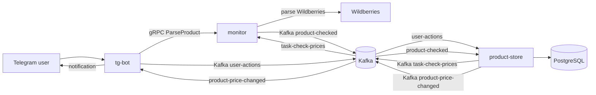

# Price Catcher

Price Catcher — учебный микросервисный проект для отслеживания цен товаров Wildberries через Telegram-бота.

Пользователь добавляет товар в боте, выбирает размер, сервис хранения сохраняет подписку, а monitor периодически проверяет актуальную цену. Если цена изменилась, бот отправляет пользователю уведомление.

## Сервисы

- `tg-bot`: Telegram-интерфейс пользователя. Добавляет/удаляет подписки, показывает список подписок, отправляет уведомления об изменении цены.
- `monitor`: gRPC-сервис парсинга Wildberries. Читает Kafka-задачи на проверку цены и публикует результат проверки.
- `product-store`: сервис хранения товаров и подписок. Работает с PostgreSQL, публикует задачи мониторинга, сравнивает старые и новые цены.
- `gen/go`: сгенерированный Go-код из protobuf-контрактов.
- `proto`: protobuf-контракты gRPC-сервисов.

Инфраструктура:

- PostgreSQL
- Kafka
- Kafka UI
- Prometheus

## Архитектура



## Kafka topics

- `user-actions`: пишет `tg-bot`, читает `product-store`. События действий пользователя: добавление и удаление подписки.
- `task-check-prices`: пишет `product-store`, читает `monitor`. Задачи на проверку актуальной цены товара/размера.
- `product-checked`: пишет `monitor`, читает `product-store`. Результат проверки цены, наличия и остатка.
- `product-checked.dlq`: пишет `product-store` при невалидных сообщениях из `product-checked`.
- `product-price-changed`: пишет `product-store`, читает `tg-bot`. Уведомления о смене цены для пользователя.

## Быстрый старт

1. Запусти инфраструктуру:

```bash
docker compose up -d postgres kafka kafka-ui prometheus
```

2. Создай локальные env-файлы:

```bash
cp product-store/.env.example product-store/.env
cp monitor/.env.example monitor/.env
cp tg-bot/.env.example tg-bot/.env
```

В `tg-bot/.env` укажи настоящий токен:

```env
TELEGRAM_BOT_TOKEN=your_bot_token
```

3. Примени миграции PostgreSQL:

```bash
docker exec -i pricepulse_db psql -U pricepulse_user -d shop < product-store/internal/migrations/001_create_products_table.sql
docker exec -i pricepulse_db psql -U pricepulse_user -d shop < product-store/internal/migrations/002_create_products_size_table.sql
docker exec -i pricepulse_db psql -U pricepulse_user -d shop < product-store/internal/migrations/003_create_user_subscription.sql
```

4. Создай Kafka topics:

```bash
docker exec -it price-catcher-kafka /opt/kafka/bin/kafka-topics.sh --bootstrap-server localhost:9092 --create --if-not-exists --topic user-actions --partitions 1 --replication-factor 1
docker exec -it price-catcher-kafka /opt/kafka/bin/kafka-topics.sh --bootstrap-server localhost:9092 --create --if-not-exists --topic task-check-prices --partitions 1 --replication-factor 1
docker exec -it price-catcher-kafka /opt/kafka/bin/kafka-topics.sh --bootstrap-server localhost:9092 --create --if-not-exists --topic product-checked --partitions 1 --replication-factor 1
docker exec -it price-catcher-kafka /opt/kafka/bin/kafka-topics.sh --bootstrap-server localhost:9092 --create --if-not-exists --topic product-checked.dlq --partitions 1 --replication-factor 1
docker exec -it price-catcher-kafka /opt/kafka/bin/kafka-topics.sh --bootstrap-server localhost:9092 --create --if-not-exists --topic product-price-changed --partitions 1 --replication-factor 1
```

Проверить список топиков:

```bash
docker exec -it price-catcher-kafka /opt/kafka/bin/kafka-topics.sh --bootstrap-server localhost:9092 --list
```

5. Запусти сервисы в отдельных терминалах:

```bash
cd product-store
go run ./cmd
```

```bash
cd monitor
go run ./cmd
```

```bash
cd tg-bot
go run ./cmd
```

## Порты

- `product-store`: `8080` HTTP health/readiness, `50051` gRPC.
- `product-store` metrics: `http://localhost:8080/metrics`.
- `monitor`: `50052` gRPC, `9102` metrics.
- `tg-bot`: `9103` metrics.
- `postgres`: `5433` на хосте, `5432` внутри контейнера.
- `kafka`: `9092` на хосте.
- `kafka-ui`: `8081`.
- `prometheus`: `9090`.

## Конфигурация

Шаблоны переменных окружения:

- `product-store/.env.example`
- `monitor/.env.example`
- `tg-bot/.env.example`

Реальные `.env` файлы игнорируются через `.gitignore`.

## Миграции

SQL-миграции лежат в:

```text
product-store/internal/migrations/
```

Сейчас используются таблицы:

- `shop.products`
- `shop.product_sizes`
- `shop.subscriptions`

## Proto/генерация

Исходники protobuf:

- `proto/productstore/product-store.proto`
- `proto/monitor/monitor.proto`

Сгенерированный Go-код лежит в:

```text
gen/go/
```

## Структура репозитория

- `docker-compose.yaml`: локальная инфраструктура.
- `product-store/`: хранение товаров, размеров и подписок.
- `monitor/`: парсинг Wildberries и обработка задач проверки.
- `tg-bot/`: Telegram UI и уведомления.
- `proto/`: protobuf-контракты.
- `gen/go/`: сгенерированный gRPC-код.
